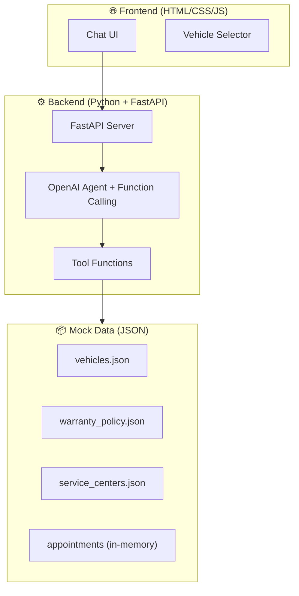

# AI Agent Bảo Hành Xe Máy Điện VinFast

## Mô tả dự án

Xây dựng một AI agent sử dụng OpenAI LLM API (function calling) để hỗ trợ khách hàng VinFast về bảo hành xe máy điện. Agent có giao diện web chat hiện đại, backend Python xử lý logic nghiệp vụ và tích hợp OpenAI API.

## Kiến trúc tổng quan



> [!IMPORTANT]
> Dự án sử dụng **mock data** (dữ liệu giả lập) thay vì kết nối database thực. Điều này phù hợp cho mục đích demo trong Lab. Người dùng cần cung cấp **OpenAI API key** qua biến môi trường `OPENAI_API_KEY`.

---

## Proposed Changes

### 1. Backend - Python + FastAPI

#### [NEW] [requirements.txt](file:///c:/Users/qv181/OneDrive/Desktop/AI_in_AC/Lab-on-class/Lab6_C401_B3/requirements.txt)
- `fastapi`, `uvicorn` — web server
- `openai` — OpenAI API client
- `pydantic` — data validation
- `python-dotenv` — environment variables

#### [NEW] [.env.example](file:///c:/Users/qv181/OneDrive/Desktop/AI_in_AC/Lab-on-class/Lab6_C401_B3/.env.example)
- Template cho file `.env` với `OPENAI_API_KEY`

#### [NEW] [app/main.py](file:///c:/Users/qv181/OneDrive/Desktop/AI_in_AC/Lab-on-class/Lab6_C401_B3/app/main.py)
- FastAPI app entry point
- CORS middleware
- Serve static files (frontend)
- API endpoints:
  - `POST /api/chat` — nhận message từ user, trả response từ agent
  - `GET /api/vehicles` — danh sách xe máy điện VinFast
  - `GET /api/vehicles/{vehicle_id}` — thông tin chi tiết xe

#### [NEW] [app/agent.py](file:///c:/Users/qv181/OneDrive/Desktop/AI_in_AC/Lab-on-class/Lab6_C401_B3/app/agent.py)
- OpenAI chat completion với function calling
- System prompt tiếng Việt chuyên nghiệp, đóng vai chuyên viên VinFast
- Tool definitions (JSON schema) cho 5 tools
- Agent loop: gọi tool → xử lý kết quả → trả lời user
- Max iterations guard (5 vòng)

#### [NEW] [app/tools.py](file:///c:/Users/qv181/OneDrive/Desktop/AI_in_AC/Lab-on-class/Lab6_C401_B3/app/tools.py)
5 tool functions:

| Tool | Mô tả | Parameters |
|------|--------|------------|
| `lookup_warranty_status` | Tra cứu tình trạng bảo hành theo `vehicle_id` | `vehicle_id: str` |
| `explain_warranty_policy` | Giải thích quyền lợi bảo hành pin/linh kiện | `category: "pin" \| "linh_kien" \| "tong_quat"` |
| `diagnose_telemetry` | Chẩn đoán sơ bộ từ telemetry data | `vehicle_id: str` |
| `find_nearest_service_center` | Tìm xưởng dịch vụ gần nhất | `city: str` |
| `create_appointment` | Đặt lịch kiểm tra/bảo dưỡng | `vehicle_id, center_id, date, service_type, note` |

#### [NEW] [app/data.py](file:///c:/Users/qv181/OneDrive/Desktop/AI_in_AC/Lab-on-class/Lab6_C401_B3/app/data.py)
- Load và quản lý mock data từ JSON files
- In-memory appointment storage
- Helper functions cho data access

---

### 2. Mock Data - JSON Files

#### [NEW] [data/vehicles.json](file:///c:/Users/qv181/OneDrive/Desktop/AI_in_AC/Lab-on-class/Lab6_C401_B3/data/vehicles.json)
6 xe giả lập thuộc các dòng: Evo200, Klara S2, Feliz S, Vento S, Theon S, Klara Neo. Mỗi xe bao gồm:
- Thông tin cơ bản: `id`, `model`, `vin`, `owner_name`, `purchase_date`
- Bảo hành: `warranty_start`, `warranty_end_vehicle`, `warranty_end_battery`
- Telemetry: `odo_km`, `battery_soh_percent`, `charge_cycles`, `operating_temp_avg`, `error_codes[]`

#### [NEW] [data/warranty_policy.json](file:///c:/Users/qv181/OneDrive/Desktop/AI_in_AC/Lab-on-class/Lab6_C401_B3/data/warranty_policy.json)
Chính sách bảo hành chi tiết (dựa trên policy thật từ 15/8/2025):
- Xe: 6 năm, không giới hạn km
- Pin LFP: 8 năm, không giới hạn km
- Điều kiện bảo hành, loại trừ, bảo dưỡng định kỳ

#### [NEW] [data/service_centers.json](file:///c:/Users/qv181/OneDrive/Desktop/AI_in_AC/Lab-on-class/Lab6_C401_B3/data/service_centers.json)
10 xưởng dịch vụ giả lập tại Hà Nội, TP.HCM, Đà Nẵng, Hải Phòng, Cần Thơ. Mỗi xưởng bao gồm:
- `id`, `name`, `address`, `city`, `phone`, `working_hours`
- `services[]`: bảo hành, bảo dưỡng, sửa chữa, thay pin...

---

### 3. Frontend - HTML/CSS/JS

#### [NEW] [static/index.html](file:///c:/Users/qv181/OneDrive/Desktop/AI_in_AC/Lab-on-class/Lab6_C401_B3/static/index.html)
- Layout: sidebar chọn xe + main chat area
- Vehicle selector panel (load từ API)
- Chat messages area (user + assistant bubbles)
- Input area: text input + send button
- Responsive design

#### [NEW] [static/style.css](file:///c:/Users/qv181/OneDrive/Desktop/AI_in_AC/Lab-on-class/Lab6_C401_B3/static/style.css)
- **Design system**: Dark mode chủ đạo với accent màu VinFast xanh (#00B14F)
- **Glassmorphism** cho cards và chat bubbles
- **Google Font** Inter
- **Animations**: smooth message appear, typing indicator, hover effects
- **Responsive**: mobile-first approach

#### [NEW] [static/app.js](file:///c:/Users/qv181/OneDrive/Desktop/AI_in_AC/Lab-on-class/Lab6_C401_B3/static/app.js)
- Fetch vehicles & render selector
- Chat message handling (send/receive)
- Markdown rendering cho assistant responses
- Typing indicator animation
- Vehicle selection state management
- Session-based conversation history

---

## System Prompt Strategy

Agent sẽ được thiết lập với system prompt:
- **Vai trò**: Chuyên viên tư vấn bảo hành xe máy điện VinFast
- **Ngôn ngữ**: Tiếng Việt, chuyên nghiệp nhưng thân thiện
- **Hành vi**: 
  - Luôn hỏi rõ thông tin xe trước khi tra cứu
  - Giải thích rõ ràng quyền lợi bảo hành
  - Cảnh báo khi telemetry bất thường
  - Chủ động gợi ý đặt lịch khi cần

---

## User Review Required

> [!IMPORTANT]
> **OpenAI API Key**: Bạn cần có API key hợp lệ từ OpenAI. Tạo file `.env` với nội dung `OPENAI_API_KEY=sk-...` trước khi chạy.

> [!WARNING]  
> **Model**: Mặc định sử dụng `gpt-4o-mini` để tiết kiệm chi phí. Có thể đổi sang `gpt-4o` hoặc `gpt-4-turbo` trong `app/agent.py` nếu cần chất lượng cao hơn.

> [!NOTE]
> **Dữ liệu giả lập**: Tất cả data là mock. Trong production cần kết nối database thực, API VinFast, và hệ thống booking thật.

---

## Verification Plan

### Automated Tests
1. Chạy server: `python -m uvicorn app.main:app --reload`
2. Test API endpoint: `GET /api/vehicles` trả về danh sách xe
3. Test chat flow qua browser

### Manual Verification (Browser)
1. Mở giao diện web → chọn xe từ sidebar
2. Hỏi về tình trạng bảo hành → agent gọi `lookup_warranty_status`
3. Hỏi về quyền lợi pin → agent gọi `explain_warranty_policy`
4. Hỏi chẩn đoán xe → agent gọi `diagnose_telemetry`
5. Hỏi xưởng gần nhất → agent gọi `find_nearest_service_center`
6. Đặt lịch bảo dưỡng → agent gọi `create_appointment`

---

## Cấu trúc thư mục cuối cùng

```
Lab6_C401_B3/
├── .env.example
├── .env                     # (user tạo, chứa API key)
├── requirements.txt
├── requirements.md          # (file gốc)
├── app/
│   ├── __init__.py
│   ├── main.py              # FastAPI server
│   ├── agent.py             # OpenAI agent logic
│   ├── tools.py             # Tool functions  
│   └── data.py              # Data management
├── data/
│   ├── vehicles.json
│   ├── warranty_policy.json
│   └── service_centers.json
└── static/
    ├── index.html
    ├── style.css
    └── app.js
```
